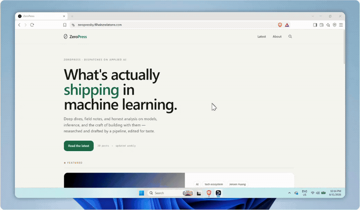

# ZeroPress - Zero-Touch AI Publishing Platform

> An end-to-end automated content pipeline that researches trending topics, writes SEO-optimized blog posts, generates cover images, publishes to a custom Next.js site, distributes newsletters, and logs performance - with zero human intervention.

[](https://zeropressby.filheinzrelatorre.com)


<br>

<p align="center"></p>

---

## Overview

ZeroPress is a production-grade, fully automated publishing system. On-demand via a secure admin panel (and optionally every 6 hours on a schedule - see Changelog), the n8n pipeline:

1. Scans 4 independent data sources for trending AI topics
2. Scores and ranks candidates with a deduplication engine
3. Selects the best topic using an LLM with brand safety gating
4. Researches it with 3 parallel live Google Search queries
5. Writes a 1,500–2,500 word SEO article in HTML
6. Generates a custom cover image via Hugging Face FLUX.1-schnell
7. Publishes to this Next.js site via an authenticated REST API
8. Emails all active subscribers via Brevo
9. Logs every run to Google Sheets for analytics

**Total infrastructure cost: $0/month** - built entirely on free tiers.

---

## Pipeline Architecture

```
Webhook / Schedule Trigger (every 6 hrs)
              │
              ▼
     Pipeline Config Node
     (niche · voice · thresholds)
              │
   ┌──────────┼──────────┬──────────┐
   ▼          ▼          ▼          ▼
 Reddit      RSS      G.Trends   Mastodon
   └──────────┴──────────┴──────────┘
              │
              ▼
    Merge → Dedup → Rank  (top 15)
              │
              ▼
   Groq LLM - Topic Selection
     + Brand Safety Gate
              │
     ┌────────┼────────┐
     ▼        ▼        ▼
  SERP #1  SERP #2  SERP #3
     └────────┴────────┘
              │
              ▼
    Aggregate Research (20 items)
              │
     ┌────────┼────────┐
     ▼        ▼        ▼
  Blog Post  Social  FLUX Image
  (Groq)    (Groq)   (HuggingFace)
     └────────┴────────┘
              │
     Duplicate Check (Supabase)
              │
     Publish to ZeroPress API
              │
         Inject Post URL
              │
     ┌────────┴────────┐
     ▼                 ▼
  Newsletter        Log Run
  (Brevo)       (Google Sheets)
```

**37 nodes · 4 data sources · 3 AI models · 6 integrations**

---

## Tech Stack

| Layer | Technology |
|---|---|
| Orchestration | n8n (self-hosted) |
| LLM | Groq · Llama 3.3 70B |
| Image generation | Hugging Face · FLUX.1-schnell |
| Research | SerpAPI (Google Search + Trends) |
| Data sources | RSS, Reddit, Mastodon, Google Trends |
| Database | Supabase (PostgreSQL + RLS) |
| Storage | Supabase Storage |
| Frontend | Next.js 15 (App Router + ISR) |
| Hosting | Vercel (Edge Network) |
| Email | Brevo Transactional API |
| Analytics logging | Google Sheets |
| Styling | Tailwind CSS v4 |

---

## Frontend Features

| Feature | Description |
|---|---|
| Blog feed | ISR (60s revalidation), featured hero, bento grid |
| Post pages | Auto table of contents, reading progress bar, related posts |
| Tag system | Per-tag archive pages with co-occurring tag cloud |
| Search | Live Supabase search modal - open with ⌘K, keyboard navigable |
| Newsletter | Subscriber signup with re-subscribe support |
| Admin panel | Password-protected pipeline trigger at `/admin` |
| About page | Full pipeline documentation |

---

## Security

- All write API routes protected with Bearer token authentication
- Admin panel uses a dedicated `ADMIN_SECRET` separate from the n8n API key
- Rate limiting on admin auth endpoint (5 attempts / 15 min per IP)
- Timing-safe password comparison via `crypto.timingSafeEqual`
- Admin session stored in `sessionStorage` - cleared on tab close
- Supabase service role key is server-only, never exposed to the client
- Public reads use the anon client with Row Level Security enforced
- Image `remotePatterns` restricted to `*.supabase.co`
- `/admin` excluded from search engine indexing via `robots.txt`

---

## Project Structure

```
src/
├── app/
│   ├── page.js                  # Home feed
│   ├── about/page.js            # Pipeline documentation
│   ├── post/[slug]/page.js      # Article page
│   ├── tag/[tag]/page.js        # Tag archive
│   ├── admin/page.js            # Protected pipeline trigger
│   └── api/
│       ├── posts/route.js       # POST/GET posts (n8n integration)
│       ├── newsletter/route.js  # Subscriber signup
│       ├── trigger-workflow/    # Proxy trigger to n8n webhook
│       └── admin/verify/        # Auth endpoint (rate-limited)
├── components/
│   ├── SearchModal.js           # Live search (⌘K)
│   ├── NewsletterForm.js        # Email signup form
│   ├── TableOfContents.js       # Auto-generated from post headings
│   ├── ReadingProgress.js       # Scroll progress bar
│   ├── PostGrid.js              # Bento grid layout
│   └── PostCard.js
└── lib/
    ├── supabase.js              # Anon + service role clients
    ├── utils.js                 # Date, cover, reading time helpers
    └── parseHeadings.js         # HTML heading ID extractor
scripts/
├── generate-key.js              # Generate a cryptographically secure key
└── rotate-secrets.js            # Rotate secrets and update .env
```

---

## Environment Variables

```bash
# Supabase
NEXT_PUBLIC_SUPABASE_URL=
NEXT_PUBLIC_SUPABASE_ANON_KEY=
SUPABASE_SERVICE_ROLE_KEY=

# API auth - used by n8n to publish posts
API_SECRET_KEY=

# Admin panel - separate from API key
ADMIN_SECRET=

# n8n webhook
N8N_WEBHOOK_URL=
N8N_BEARER_TOKEN=

# Site metadata
NEXT_PUBLIC_SITE_URL=
NEXT_PUBLIC_SITE_NAME=
NEXT_PUBLIC_SITE_DESCRIPTION=
```

---

## Local Setup

```bash
git clone https://github.com/jabluetooth/zeropress.git
cd zeropress
npm install

# Copy env template and fill in your keys
cp .env.example .env

npm run dev
# → http://localhost:3000
```

---

## Scripts

```bash
# Generate a new cryptographically secure API key
npm run generate-key

# Rotate all secrets in .env (backs up to .env.bak first)
npm run rotate-secrets            # rotate everything
npm run rotate-secrets:api        # rotate API_SECRET_KEY + N8N_BEARER_TOKEN
npm run rotate-secrets:admin      # rotate ADMIN_SECRET only
npm run rotate-secrets:preview    # preview new keys without writing
```

---

## API Reference

### `POST /api/posts`
Creates or updates a post (upserts by slug). Called by n8n after content generation.

**Headers:** `Authorization: Bearer <API_SECRET_KEY>`

**Body:**
```json
{
  "title": "Post Title",
  "slug": "post-slug",
  "body_html": "<article>...</article>",
  "excerpt": "Short summary",
  "meta_description": "SEO description (max 155 chars)",
  "featured_image_url": "https://...",
  "tags": ["ai", "llm"],
  "status": "published",
  "word_count": 2000,
  "primary_keyword": "llm",
  "run_id": "run_1234567890",
  "interest_score": 75
}
```

**Response `201`:**
```json
{
  "id": "uuid",
  "slug": "post-slug",
  "link": "https://zeropressby.filheinzrelatorre.com/post/post-slug",
  "status": "published",
  "title": "Post Title",
  "created": true
}
```

### `GET /api/posts`
Lists published posts. Query params: `limit` (1–100, default 10), `tag`.

### `POST /api/newsletter`
Subscribes an email address. Body: `{ "email": "user@example.com" }`

---

## Database Schema

**`posts`** - `id, title, slug, excerpt, body_html, meta_description, featured_image_url, primary_keyword, tags[], status, word_count, reading_time, published_at, run_id, interest_score`

**`subscribers`** - `id, email, subscribed_at, confirmed, unsubscribed`

RLS enabled on both tables. Anonymous SELECT restricted to `status = 'published'` posts only. All writes require the service role key.

---

## Deploying to Vercel

1. Push to GitHub
2. Import the repo in [vercel.com](https://vercel.com)
3. Add all environment variables from the list above
4. Deploy - Vercel handles the rest

> After updating any environment variable in Vercel, trigger a manual redeploy for changes to take effect.

---

## n8n Workflow

The full n8n workflow definition that powers this pipeline is exported at [`ZeroPress.json`](./ZeroPress.json) in the repo root. Import it into a self-hosted n8n instance to inspect or re-run the pipeline (requires the credentials noted in `.env.example`: Groq, SerpAPI, Hugging Face, Supabase, Brevo, and the ZeroPress API bearer token).

## Changelog

- **2026-07-29** - Verified the 6-hour schedule trigger (`Every 6 Hours`) would be safe to enable as a documented fallback alongside the primary webhook (checked it against the existing two-layer duplicate-topic detection: fuzzy title-overlap filtering against the last 15 published posts, plus an exact slug check immediately before publish/email). The trigger is currently left **disabled** pending an explicit decision to turn on unsupervised, recurring auto-publish-and-email - since flipping it on has real consequences for live subscribers and the live site, that's a call for a human to make deliberately rather than something to flip silently as a "bug fix."
- **2026-07-29** - Added retry (`retryOnFail`, 3 tries, 2s backoff) to the RSS, Reddit, Google Trends, Mastodon, SerpAPI research, and site-publish HTTP calls, which previously had no resilience against transient failures. The four scraping sources (RSS/Reddit/Trends/Mastodon) also continue past a hard failure (`continueRegularOutput`) so one dead source degrades gracefully instead of killing the run; the SerpAPI research calls and the final publish-to-site call intentionally do **not** get that same continue-on-fail treatment, so a real failure there still surfaces loudly rather than silently short-circuiting a publish or email step.

---

## About the developer

**Fil Heinz O. Re La Torre** - Automation & AI Solutions Engineer, building integrations and AI-backed workflows that go from idea to production in days.

[](https://www.filheinzrelatorre.com)
[](https://ph.linkedin.com/in/filheinzrelatorre)
[](https://github.com/jabluetooth)
[](mailto:filheinz27@gmail.com)

**Other projects:** [Match](https://github.com/jabluetooth/match) · [Mimo](https://github.com/jabluetooth/mimo) · [Insight](https://github.com/jabluetooth/insight) · [Se7en](https://github.com/jabluetooth/se7en) · [see all →](https://github.com/jabluetooth)

## License

MIT - see [LICENSE](LICENSE)
